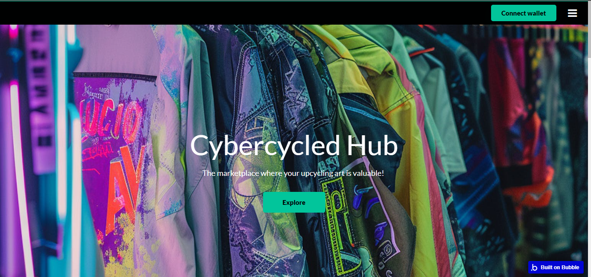
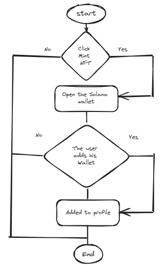

# CYBERCYCLED

[Version en Español](https://github.com/Antoni0Pachec0/CYBERCYCLED/blob/main/README.md)

**Our Website:** [CYBERCYCLED](https://cybercycled-hub.bubbleapps.io/version-test/)

### Video Demo on Youtube:

## Who are we?
We are a collective of idealists and passionate individuals in the fashion realm, where we believe that enjoying the identity provided by choosing authentic garments should not result in total ecocide but rather be a way to connect with our individuality and sustainability. We connect the community of eco-enthusiasts who want to dress fashionably with the most cutting-edge exhibitors of modified clothing in Latin America through blockchain technology and a tokenized marketplace.

## How do we do it?
We redefine the value within the fashion industry by tokenizing vintage, second-hand, and modified garments. With our valuation algorithm for each piece, we issue a token that provides traceability, economic value, and history. You can check out all these unique pieces of clothing on our marketplace and acquire them to look amazing while contributing to a better planet.

## Why do we do it?
The visibility of the upcycled garment designer community is crucial to us, where a garment becomes a piece of art instead of ending up in a landfill. We aim to contribute to reducing the climate catastrophe caused by the textile industry through what truly matters: durable and storied clothing has much more value than fast fashion.

## Technologies we use:
 - **UI Development** - [Bubble](https://bubble.io/)

- **What is Bubble?**  -
Bubble.io is a web application development platform that allows people to create applications without writing code. It offers a visual development environment where users can design and develop complete web applications using a drag-and-drop editor.

- **How does Bubble work?** -
It operates with a visual editor where users can design and develop complete web applications using a drag-and-drop editor. The application behavior can be configured through workflows. The platform also provides an integrated database and allows deployment and hosting of applications.

- **Front-end:** -
Users drag and drop elements like buttons, text fields, and images to design the application's user interface. They can then customize the style and layout of these elements as needed.

- **Back-end:** -
It is mainly managed through workflows and the integrated database. Users can define workflows to perform actions such as storing data in the database, sending emails, processing payments, and more. The integrated database allows storing and manipulating data within the application, and users can define custom data types and relationships between them.

- **Plugin:**  -
Bubble.io allows integrating external plugins and APIs to extend the functionality of the back-end, such as online payments, analytics, and user authentication.

## Plugins
 - **Metaplex** - [Metaplex Plugin](https://novabloq.com/plugin/metaplex---solana-nfts-1672944569246x875969888490958300)
  - **Phantom** - [Phantom Wallet Plugin](https://bubble.io/plugin/phantom-login-for-solana-1641357341035x265322829267337200)

## "Flowcharts - Buttons"

