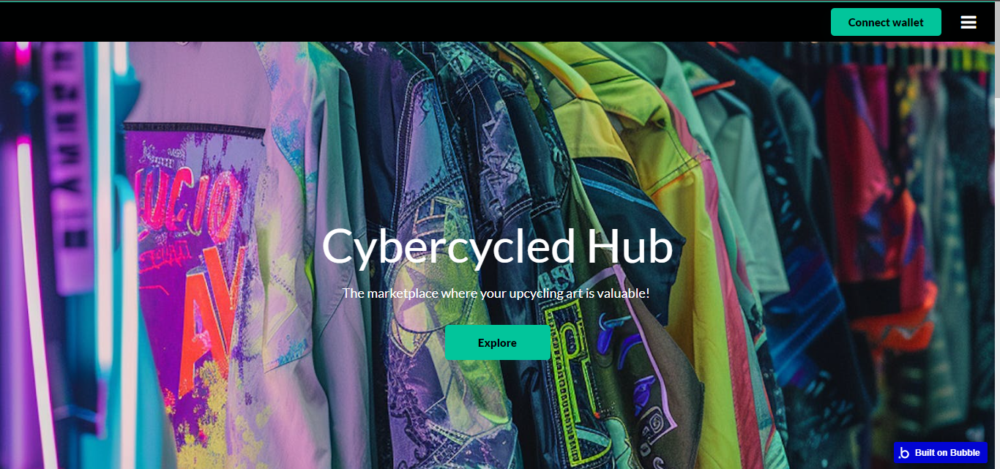
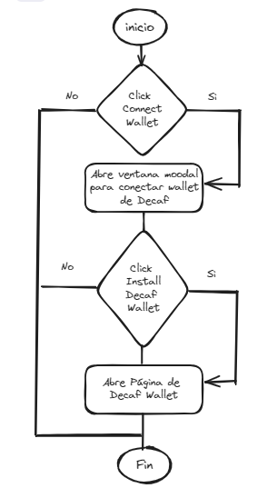

# CYBERCYCLED

[English Version](#english-version)

**Nuestra página web:** [CYBERCYCLED](https://cybercycled-hub.bubbleapps.io/version-test/)

### Video Demo en Youtube: 

## ¿Quiénes somos?
Somos un colectivo de idealistas y apasianodxs de la moda, donde creemos que el disfrutar de la identidad que nos da el elegir prendas auténticas no debe ser un ecocidio total, sino una forma de conectar con nuestra individualidad y la sostenibilidad.  Conectamos la comunidad de eco apasionadxs que quieren vestirse fashion con los expositores de ropa modificada más vanguardistas de América Latina a través de la tecnología blockchain y un marketplace tokenizado. 

## ¿Cómo lo hacemos?
Resignificamos lo valioso dentro de la industria de la moda a través de la tokenización de prendas vintage, de segunda mano y modificadas. Con nuestro algoritmo de valorización de cada pieza, emitimos un token que le da trazabilidad, valor económico e historia. Puedes checar en nuestro marketplace todas estas piezas de ropa únicas y adquirirlas, para verte increíble mientras contribuyes a un mejor planeta.

## ¿Por qué lo hacemos?
Es muy importante para nosotrxs la visibilización de la comunidad de diseñadorxs de prendas upcycled, en la que una prenda acaba siendo una pieza de arte en vez de terminar en un basurero. Queremos contribuir a disminuir la catastrofe climatica causada por la industria textil a través de lo que realmente es importante: la ropa que es duradera y tiene historia tiene mucho más valor que el fast fashion.

## Tecnologías que utilizamos: 
  - **Desarrollo de la UI** - [Bubble](https://bubble.io/)

- **¿Qué es Bubble?** -
Bubble.io es una plataforma de desarrollo de aplicaciones web que permite a las personas **crear aplicaciones sin necesidad de escribir código**. Ofrece un entorno de desarrollo visual en el que los usuarios pueden diseñar y desarrollar aplicaciones web completas utilizando un editor de arrastrar y soltar.

- **¿Comó funciona Buble?** -
Funciona con un editor visual en el que los usuarios pueden diseñar y desarrollar aplicaciones web completas utilizando un **editor de arrastrar y soltar**. Se puede configurar el comportamiento de la aplicación a través de **workflows**. La plataforma también proporciona una base de datos integrada y permite el despliegue y alojamiento de las aplicaciones.

- **Frond-end:** -
Los usuarios arrastran y sueltan elementos como botones, campos de texto e imágenes para diseñar la interfaz de usuario de la aplicación. Luego, pueden personalizar el estilo y la disposición de estos elementos según sea necesario.

- **Back-end:** -
Se gestiona principalmente a través de workflows y la base de datos integrada. Los usuarios pueden definir workflows para realizar acciones como almacenar datos en la base de datos, enviar correos electrónicos, procesar pagos y mucho más. La base de datos integrada permite almacenar y manipular datos dentro de la aplicación, y los usuarios pueden definir tipos de datos personalizados y relaciones entre ellos.

- **Plugin:** -
Bubble.io permite integrar plugins y API externas para ampliar la funcionalidad del back-end, como pagos en línea, análisis y autenticación de usuarios.

## Plugins
  - **Metaplex** - [Metaplex Plugin](https://novabloq.com/plugin/metaplex---solana-nfts-1672944569246x875969888490958300)
  - **Phantom** - [Phantom Wallet Plugin](https://bubble.io/plugin/phantom-login-for-solana-1641357341035x265322829267337200)

## Diagramas de flujo "Botones"

# English Version
